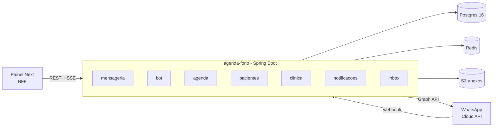
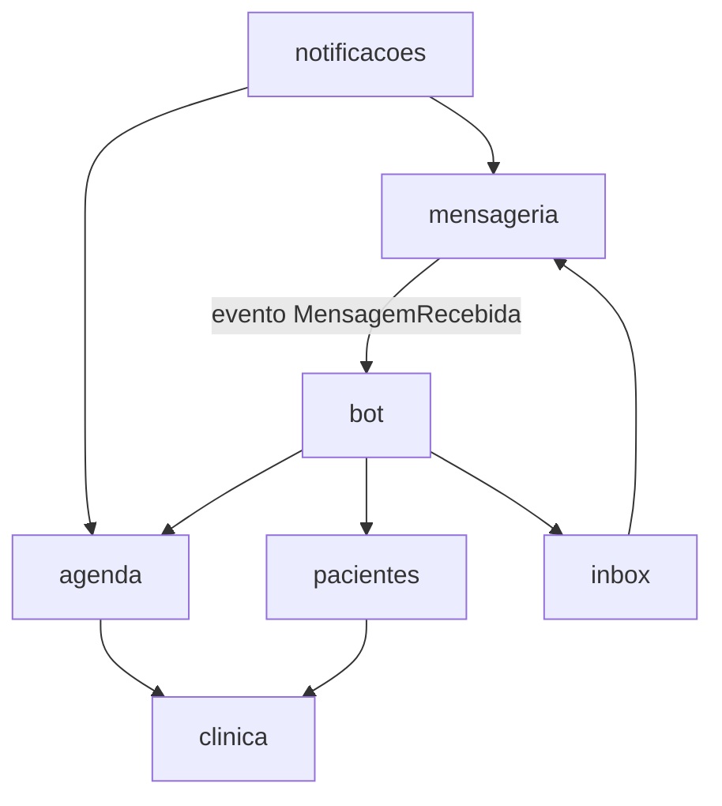
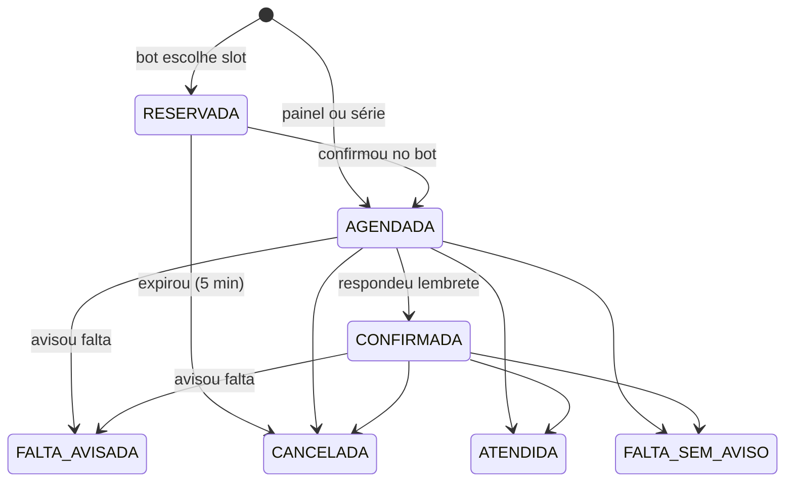
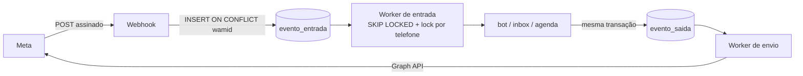
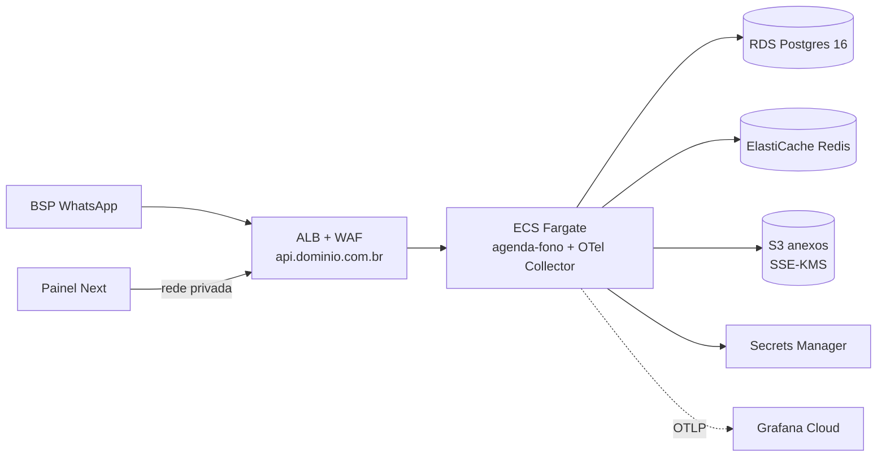

# SDD — Backend do agenda-fono

> Versão viva: https://claude.ai/code/artifact/c26f5bb5-171a-499d-9009-2c0e7db40a8b

Atualizado em 23/09/2026 · Jamilson Nunes Pereira

## 1. Contexto, objetivos e requisitos não funcionais

O backend `agenda-fono` é a única fonte de verdade do produto: guarda agendas e pacientes, conversa com o WhatsApp por meio de um parceiro oficial (BSP) e serve a API REST do [painel web](https://claude.ai/code/artifact/5e992025-2a3e-4083-afbb-e27110cfbbbb). Os requisitos funcionais e as regras de negócio (RN-xx) estão na [Especificação do MVP](https://claude.ai/code/artifact/00bafcb3-a864-4dad-ac52-2e5c9128b537); este SDD define como construí-los.

**Escopo do MVP:** apenas atendimento particular. Convênio, guias e carteirinha ficam fora do MVP e voltam numa migration futura; as regras RN-30 e RN-31 da especificação não se aplicam por enquanto.

**Objetivos técnicos**

1. Nunca permitir dois agendamentos no mesmo horário do mesmo fono ou sala, mesmo com bot e recepção agendando ao mesmo tempo.
2. Responder ao webhook da Meta em milissegundos e processar cada mensagem exatamente uma vez, na ordem, por contato.
3. Isolar os dados de cada clínica de forma que um bug de código não vaze dados entre clínicas.
4. Ser operável por uma pessoa: um deploy, um banco, poucas peças.

**Requisitos não funcionais**

| ID | Requisito | Meta no piloto |
| --- | --- | --- |
| RNF-01 | Tempo de resposta do webhook | p99 até 200 ms |
| RNF-02 | Tempo entre mensagem recebida e resposta do bot | p95 até 3 s |
| RNF-03 | Latência da API do painel | p95 até 300 ms; `GET /disponibilidade` até 500 ms |
| RNF-04 | Disponibilidade mensal | 99,5% (cerca de 3,6 h de indisponibilidade por mês) |
| RNF-05 | Escala | 50 clínicas, 500 fonos, 10 mil sessões por semana sem mudar a arquitetura |
| RNF-06 | Perda de dados | RPO até 5 min, RTO até 4 h |
| RNF-07 | Lembretes | 100% dos lembretes da véspera enviados até o horário configurado + 15 min |
| RNF-08 | Residência de dados | Dados e backups na região de São Paulo |
| RNF-09 | Segurança | OWASP ASVS nível 1 antes do piloto, nível 2 antes de escalar |

## 2. Visão de arquitetura e decisões

O backend é um monólito modular em Spring Boot com Postgres como peça central: dados, fila de eventos e garantias de conflito ficam no banco. Redis entra só para deduplicação rápida, locks curtos e rate limit.



O mesmo artefato roda em dois papéis, escolhidos por profile: `api` (HTTP) e `worker` (fila de eventos e jobs). No piloto, uma instância faz os dois; separar é só configuração.

| ID | Decisão | Alternativa descartada | Motivo |
| --- | --- | --- | --- |
| ADR-01 | Monólito modular com Spring Modulith | Microsserviços | Uma pessoa operando; transações locais; fronteiras verificadas por teste |
| ADR-02 | Arquitetura hexagonal por módulo (domain, application, adapters) | Camadas tradicionais controller/service/repository | Regras de agenda testáveis sem Spring nem banco |
| ADR-03 | Conflito de horário garantido por `EXCLUDE USING gist` no Postgres | Lock pessimista ou checagem na aplicação | Correto sob concorrência por construção; sem janela de corrida |
| ADR-04 | Fila de eventos em tabela Postgres com `FOR UPDATE SKIP LOCKED` | Kafka, RabbitMQ, SQS | Sem infra extra; transacional com o domínio (outbox); volume baixo |
| ADR-05 | Multi-tenancy por coluna `clinica_id`, com Row-Level Security ligado no Passo 8 | Schema ou banco por clínica; RLS desde o início | Simples de migrar e operar; o RLS entra como segunda barreira antes do piloto, sem travar o desenvolvimento |
| ADR-06 | Java 21 com virtual threads | WebFlux reativo | Código imperativo simples; I/O com o provedor de WhatsApp sem bloquear threads de plataforma |
| ADR-07 | JPA para agregados + JdbcClient para consultas de agenda | Só JPA | `tstzrange` e consultas de disponibilidade ficam mais claras em SQL |
| ADR-08 | Autenticação própria com JWT (Spring Security + resource server) | Keycloak ou Cognito | Menos peças no piloto; troca possível depois sem mudar o painel |
| ADR-09 | Máquina de estados do bot em código puro | Spring Statemachine; LLM | Fluxo pequeno e determinístico; fácil de testar |
| ADR-10 | Spring Boot 4.1 desde já (migrado no Passo 0) | Ficar na 3.5 e migrar antes do piloto | Projeto ainda pequeno; a linha 3.5 está fora do suporte OSS; evita migração com código grande |
| ADR-11 | WhatsApp via parceiro oficial da Meta (BSP) no piloto | Integração direta como Tech Provider | Conectar os números das clínicas sem esperar a verificação de Tech Provider; custo por mensagem um pouco maior |
| ADR-12 | Observabilidade no Grafana Cloud via OpenTelemetry | CloudWatch + X-Ray | Logs, métricas, traces e alertas num lugar só; independente da AWS |
| ADR-13 | Histórico de mensagens retido por 15 dias | 12 meses | Minimização de dados (LGPD); o registro de agendamentos e consentimentos fica no domínio, não nas mensagens |
| ADR-14 | MVP só com atendimento particular | Convênio e guias no MVP | Menos escopo e menos dados sensíveis (sem carteirinha) no piloto |

## 3. Módulos, camadas e pacotes

São 7 módulos de negócio e um núcleo compartilhado. Um módulo só usa outro pela API pública dele (interfaces no pacote raiz do módulo) ou por eventos; o Spring Modulith falha o build se alguém acessar pacotes internos.



As setas mostram quem depende de quem. `agenda`, `pacientes` e `clinica` não conhecem o WhatsApp; `bot` e `notificacoes` orquestram.

| Módulo | Responsabilidade | API pública (exemplos) | Eventos publicados |
| --- | --- | --- | --- |
| `clinica` | Tenants, usuários, autenticação, profissionais, grades, bloqueios, políticas | `ClinicaConsulta`, `ProfissionalConsulta` | `BloqueioCriado` |
| `pacientes` | Responsáveis, pacientes, anexos, consentimento | `PacienteConsulta` | `ConsentimentoRegistrado` |
| `agenda` | Disponibilidade, sessões, séries, reposições, lista de espera | `Disponibilidade`, `Agendamento`, `Presenca` | `SessaoAgendada`, `SessaoCancelada`, `FaltaAvisada`, `VagaLiberada` |
| `mensageria` | Webhook do BSP, fila de entrada, deduplicação, envio, templates, mídia | `EnvioWhatsApp` | `MensagemRecebida`, `BotaoClicado`, `StatusEntrega` |
| `bot` | Máquina de estados da conversa | — (reage a eventos) | `TransbordoSolicitado` |
| `inbox` | Conversas em modo humano, respostas da recepção | `InboxServico` | `ConversaDevolvidaAoBot` |
| `notificacoes` | Lembretes, ofertas de vaga, avisos em massa | — (jobs e eventos) | — |
| `compartilhado` | Contexto de tenant, relógio, IDs, Problem Details, eventos base | `TenantContext`, `Relogio` | — |

**Estrutura interna de cada módulo**

```
br.com.agendafono.agenda
├── Disponibilidade.java          # porta de entrada pública (interface)
├── Agendamento.java
├── SessaoAgendada.java           # evento público (record)
├── domain/                        # entidades, value objects, regras; sem Spring
│   ├── Sessao.java, Serie.java, Periodo.java, StatusSessao.java
│   └── CalculadoraDisponibilidade.java
├── application/                   # casos de uso, transações, portas de saída
│   ├── AgendarSessaoUseCase.java
│   └── port/SessaoRepository.java
└── adapter/
    ├── in/web/SessaoController.java, dto/
    └── out/persistence/SessaoJpaRepository.java, DisponibilidadeSql.java
```

**Regras:** `domain` não importa Spring nem JPA (as entidades JPA ficam em `adapter/out/persistence` e são mapeadas); `application` conhece só portas; controllers não têm regra de negócio. O relógio é sempre injetado (`Relogio`), nunca `Instant.now()` direto, para testes de tempo determinísticos.

## 4. Modelo de domínio, agregados e invariantes

São 5 agregados principais no MVP. Cada um é alterado numa transação própria; referências entre agregados são só por ID.

| Agregado (módulo) | Raiz e filhos | Invariantes que a raiz garante |
| --- | --- | --- |
| Profissional (`clinica`) | Profissional, GradeSemanal | Intervalos da grade não se sobrepõem no mesmo dia; duração entre 10 e 240 min |
| Responsável (`pacientes`) | Responsável, Pacientes | Telefone E.164 único por clínica; sem consentimento não há cadastro de paciente pelo bot |
| Série (`agenda`) | Série | Status ATIVA → PAUSADA → ATIVA ou ENCERRADA; encerrada não volta; mudar horário afeta só sessões futuras não confirmadas |
| Sessão (`agenda`) | Sessão | Transições de status válidas (abaixo); RESERVADA tem `expiraEm`; sem sobreposição ativa (garantido pelo banco) |
| Conversa (`bot`) | Conversa, contexto | Um estado por vez; em modo HUMANO o bot não responde |

**Ciclo de vida da sessão**



ATENDIDA, CANCELADA, FALTA\_AVISADA e FALTA\_SEM\_AVISO são finais. Registrar presença ou falta só é aceito a partir do início da sessão; correções de presença em até 7 dias ficam na trilha de auditoria.

**Value objects principais:** `Periodo` (início e fim em `Instant`, fim > início, sempre semiaberto `[início, fim)`), `Telefone` (E.164 validado), `FusoClinica` (`ZoneId`), `DiasSemana` (conjunto ISO 1–7), `Demanda` (enum das subáreas).

**Efeitos colaterais por evento, nunca por chamada direta:** FALTA\_AVISADA dentro do prazo publica `FaltaAvisada`, que cria o crédito de reposição e libera a vaga (`VagaLiberada`). Quando o convênio voltar ao escopo, ATENDIDA publicará `SessaoAtendida` para o consumo da guia, sem mudar o módulo `agenda`.

## 5. Persistência e multi-tenancy

A migration `V1__schema_inicial.sql`, já no repositório, cria as 13 tabelas do domínio do MVP com as constraints de conflito testadas. As tabelas de convênio, guia e a coluna de carteirinha foram retiradas do V1 (nada foi aplicado em nenhum ambiente ainda) e voltam numa migration própria quando o convênio entrar no escopo. As próximas migrations acrescentam filas, auditoria e autenticação; o Row-Level Security é ligado no Passo 8.

**Tabelas a acrescentar**

| Migration | Tabela | Uso |
| --- | --- | --- |
| V2 | `evento_entrada` | Fila de eventos do webhook: `id`, `wamid` único, `clinica_id`, `telefone`, `payload jsonb`, `status`, `tentativas`, `proxima_tentativa_em` |
| V2 | `evento_saida` (outbox) | Mensagens a enviar para a Meta, gravadas na mesma transação do domínio |
| V2 | `mensagem` | Histórico da conversa para a inbox: direção, tipo, texto, `wamid`, status de entrega |
| V3 | `refresh_token` | Hash do token, usuário, expiração, revogado, família (para detectar reuso) |
| V3 | `auditoria` | Quem, quando, ação, entidade, ID, diff sem dados sensíveis |
| V4 | `credito_reposicao` | Paciente, fono, sessão de origem, validade, sessão usada |
| V4 | `oferta_vaga` | Vaga liberada, destinatário, expiração, resposta |
| V4 | `event_publication` | Registro de eventos do Spring Modulith (garante entrega após falha) |
| V5 | políticas RLS | Ligação do Row-Level Security em todas as tabelas com `clinica_id` |

O schema completo do domínio está na Especificação do MVP (seção 5) e no próprio V1.

**Multi-tenancy com Row-Level Security**

A aplicação conecta com um usuário `agenda_app` que **não** é dono das tabelas (o dono ignora RLS). No início de cada transação, um interceptador define o tenant a partir do `TenantContext`:

```sql
-- V5: uma política por tabela com clinica_id
ALTER TABLE sessao ENABLE ROW LEVEL SECURITY;
ALTER TABLE sessao FORCE ROW LEVEL SECURITY;
CREATE POLICY tenant_isolation ON sessao
  USING (clinica_id = current_setting('app.clinica_id')::uuid)
  WITH CHECK (clinica_id = current_setting('app.clinica_id')::uuid);

-- a cada transação (feito pela aplicação)
SELECT set_config('app.clinica_id', :clinicaId, true);  -- true = só nesta transação
```

- Na API, o `clinica_id` vem do JWT; no worker, do evento sendo processado; nos jobs, o job itera clínica por clínica.
- Sem tenant definido, `current_setting` falha e a consulta não retorna nada: o padrão é negar.
- Processos que atravessam clínicas (ex.: descobrir a clínica pelo `phone_number_id` do webhook) usam um usuário separado `agenda_sistema` com `BYPASSRLS`, restrito ao módulo `mensageria`.

**Convenções**

- Flyway, uma migration por mudança, nunca editar migration já aplicada em homologação.
- Mudanças compatíveis para deploy sem parada: adicionar coluna nula → preencher → tornar obrigatória em outra versão.
- Tempos sempre `timestamptz`; datas civis (`data_nascimento`, `validade`) como `date`.
- Controle otimista com coluna `versao` (`@Version`) em sessão, série e conversa.
- Hikari com 20 conexões por instância; consultas acima de 500 ms registradas em log.

## 6. Algoritmos centrais

Disponibilidade é calculada em memória a partir de uma única consulta por intervalo. Toda escrita de horário confia na constraint do banco como árbitro final.

### 6.1 Cálculo de disponibilidade (RN-01, RN-02)

Entrada: profissional, duração (do tipo de sessão), intervalo de datas no fuso da clínica. Saída: lista de `Periodo` livres.

1. Para cada data do intervalo, pegar os blocos da grade daquele dia da semana e converter `data + hora` no fuso da clínica para `Instant`.
2. Subtrair bloqueios do profissional e da clínica inteira que se sobrepõem.
3. Subtrair sessões ativas: AGENDADA, CONFIRMADA e RESERVADA ainda não expirada.
4. Fatiar cada trecho livre em slots do tamanho da duração, a partir do início do trecho, com passo igual à duração (passo configurável por clínica, ex.: 15 min).
5. Descartar slots antes de `agora + antecedênciaMínima` ou depois de `agora + janelaMáxima`.
6. Se a grade indicar sala, subtrair também sessões ativas da sala.

A `CalculadoraDisponibilidade` fica em `domain`, recebe grade, bloqueios, sessões e relógio como dados e não acessa banco, o que permite testes por propriedade (nenhum slot devolvido sobrepõe sessão ou bloqueio). A consulta que alimenta o cálculo usa o índice `(clinica_id, profissional_id, lower(periodo))` e `periodo && tstzrange(:de, :ate)`.

### 6.2 Pré-reserva e confirmação (RN-04)

```mermaid
sequenceDiagram
    participant B as Bot
    participant A as agenda
    participant DB as Postgres
    B->>A: reservar(slot)
    A->>DB: INSERT sessao RESERVADA expira_em=agora+5min
    alt 23P01 conflito
        A->>DB: cancela reservas expiradas do fono
        A->>DB: tenta INSERT de novo (1 vez)
        A-->>B: HorarioIndisponivel + 3 alternativas
    else ok
        A-->>B: reservaId
    end
    B->>A: confirmar(reservaId)
    A->>DB: UPDATE status=AGENDADA WHERE id AND status=RESERVADA AND expira_em > now()
    A-->>B: 1 linha = confirmado; 0 = reserva expirou
```

A constraint não pode usar `now()`, então uma reserva expirada ainda ocupa o horário até o job limpá-la. Por isso, diante de um conflito, o caso de uso cancela as reservas vencidas daquele fono e tenta uma segunda vez antes de desistir.

### 6.3 Materialização de séries (RN-10, RN-11)

- Job diário garante sessões de cada série ATIVA de hoje até hoje + 8 semanas.
- Idempotente por índice único `(serie_id, lower(periodo))` (acrescentar na V2): reexecutar não duplica.
- Ocorrência que cai em bloqueio ou conflito não é criada; vira uma pendência para a recepção decidir.
- Criar ou alterar uma série materializa na hora, na mesma transação, para a recepção ver o resultado de imediato.
- Alterar horário: cancela as sessões futuras AGENDADA da série e materializa de novo; CONFIRMADA não muda sem ação explícita.

### 6.4 Falta avisada e reposição (RN-20, RN-21)

- Aviso com antecedência ≥ política: sessão vai para FALTA\_AVISADA, cria `credito_reposicao` válido por N dias e publica `VagaLiberada`.
- Aviso fora do prazo: FALTA\_AVISADA sem crédito (ou com, se a política da clínica permitir).
- Agendar uma REPOSICAO consome o crédito mais antigo do mesmo fono; crédito vencido expira por job.

### 6.5 Oferta de vaga (RN-40)

1. `VagaLiberada` monta a fila de candidatos: créditos de reposição pendentes do mesmo fono, depois lista de espera por ordem de entrada.
2. Envia oferta para até 3 candidatos ao mesmo tempo, válida por 30 min (`oferta_vaga`).
3. O primeiro "Quero" tenta agendar; a constraint decide quem ganha. Os demais recebem "vaga já preenchida".
4. Sem aceite em 30 min, oferta para os próximos 3, até faltar menos de 12 h para a sessão.

## 7. Mensageria WhatsApp

Entrada e saída passam por tabelas-fila no Postgres: o webhook só grava e responde, e workers processam. Isso dá resposta rápida à Meta, processamento exatamente uma vez e reenvio seguro em falhas.

**Parceiro oficial (BSP) no piloto.** A conexão com o WhatsApp passa por um BSP em vez da integração direta. Para não prender o domínio ao fornecedor, a `mensageria` define uma porta `ProvedorWhatsApp` (enviar texto, botões, lista, template; baixar mídia; validar e traduzir o webhook) com um adaptador por BSP. Critérios de escolha do BSP:

- Webhook e envio no formato da Cloud API da Meta, para reaproveitar o código já escrito e facilitar a troca para a integração direta depois.
- Onboarding de números de clientes (embedded signup ou equivalente) e suporte a vários números numa conta.
- Autenticação do webhook por assinatura (HMAC) ou, no mínimo, por token secreto em header, além de restrição por IP quando disponível.
- Preço por mensagem transparente e repasse da tabela da Meta; contrato de operador de dados compatível com a LGPD.

A validação `X-Hub-Signature-256` já implementada vale para a integração direta; o adaptador do BSP escolhido define a sua própria validação.



**Entrada**

1. Webhook valida a autenticação do BSP, descobre a clínica pelo número de destino e grava cada mensagem em `evento_entrada` com `ON CONFLICT (wamid) DO NOTHING`, que resolve a reentrega. Responde 200.
2. Status de entrega (`sent`, `delivered`, `read`, `failed`) só atualizam a tabela `mensagem`; não passam pelo bot.
3. Worker busca lotes com `SELECT ... FOR UPDATE SKIP LOCKED` e, por evento, pega `pg_try_advisory_xact_lock` do par (clínica, telefone). Se o lock estiver ocupado, pula; isso garante ordem e um processamento por contato de cada vez.
4. Falha no processamento: nova tentativa com espera exponencial (5 s, 30 s, 2 min, 10 min, 1 h); após 5 tentativas, status `MORTO` e alerta.
5. Mensagens com mídia: o worker baixa o arquivo pela Media API da Meta logo ao processar (a URL da Meta expira em minutos), grava no S3 criptografado e guarda só a chave.

**Saída**

- Casos de uso nunca chamam a Meta diretamente: gravam em `evento_saida` na mesma transação da mudança de domínio (outbox). Se a transação falhar, nada é enviado.
- O worker de envio usa `RestClient` com timeout de 10 s. Erros 429 e 5xx voltam para a fila com espera exponencial; erros 4xx de conteúdo vão para `MORTO` com o código da Meta.
- Se a Meta recusar uma mensagem livre porque a janela de 24 h fechou, o worker não tenta de novo e registra o erro; quem decide enviar template é a recepção ou a regra de negócio.
- Toda mensagem enviada vai para a tabela `mensagem` com o `wamid` devolvido, para aparecer na inbox.

**Janela de 24 h:** a conversa guarda `ultima_msg_entrada_em`. O módulo expõe `janelaAberta(conversa)`, usado pelo bot, pela inbox e pelo painel.

**Templates:** catálogo em código (`TemplateWhatsApp` com nome, idioma `pt_BR`, parâmetros e botões) e situação de aprovação por clínica numa tabela. O payload dos botões leva um identificador assinado (`acao:sessaoId:hmac`) para impedir que alguém forje uma confirmação.

**Credenciais:** chave de API do BSP (por conta ou por número, conforme o BSP) guardada no AWS Secrets Manager e carregada com cache de 10 min. Nunca em log.

**Limites de envio:** rate limit por número no Redis (token bucket) abaixo do limite da Meta, e avisos em massa (RF-23) espalhados em lotes.

## 8. Motor do bot

O bot é uma máquina de estados determinística: cada estado é uma classe que recebe a mensagem e o contexto e devolve a transição e as respostas. Os estados e o fluxo estão na seção 6 da Especificação do MVP.

```java
public interface EtapaConversa {
    EstadoConversa estado();
    Transicao tratar(Entrada entrada, ContextoConversa ctx);
}

public record Transicao(
    EstadoConversa proximo,
    ContextoConversa contexto,          // imutável; nova versão a cada passo
    List<MensagemSaida> respostas,      // gravadas no outbox
    List<Object> eventos) {}            // ex.: TransbordoSolicitado
```

**Fluxo de uma mensagem no worker**

1. Carrega a conversa do responsável (cria se não existir) com `versao`.
2. Se `modo = HUMANO`, grava a mensagem para a inbox e para.
3. Se a entrada é clique em botão de template (lembrete, oferta de vaga), trata pelo `TratadorDeAcao` fora da máquina de estados, em qualquer estado.
4. Se passou mais de 30 min desde a última mensagem, reinicia em `INICIO`.
5. Chama a etapa do estado atual; grava novo estado, contexto e respostas na mesma transação.
6. Entrada não reconhecida incrementa `tentativas_falhas`; na segunda, transborda para a recepção.

**Contexto da conversa** (`jsonb`, versionado por `schemaVersao`): paciente selecionado, dados coletados do paciente novo, demanda, slots oferecidos (com IDs curtos para a lista), reserva atual. Nada de histórico de mensagens no contexto.

**Concorrência:** o lock por telefone do worker (seção 7) garante uma mensagem por vez por contato; a coluna `versao` protege contra escrita concorrente vinda da inbox.

**Textos:** mensagens do bot num catálogo (`MensagensBot`) com parâmetros, não espalhadas no código; permite ajustar tom e testar textos por snapshot.

**Limites da API da Meta que moldam as respostas:** botões de resposta com até 3 opções; listas com até 10 itens. Por isso o bot oferece 5 horários + "Ver mais datas".

**Testes:** cada etapa é testada como função pura; conversas completas são testadas como roteiros (`dado mensagem X no estado Y, então estado Z e resposta W`) sem Spring.

## 9. Jobs agendados e eventos de domínio

Jobs rodam só no papel `worker`, com ShedLock garantindo uma execução por vez mesmo com várias instâncias. Todos são idempotentes: rodar duas vezes não duplica efeito.

| Job | Frequência | O que faz | Idempotência |
| --- | --- | --- | --- |
| ExpirarReservas | 1 min | RESERVADA com `expira_em` vencido → CANCELADA | `WHERE status='RESERVADA' AND expira_em < now()` |
| EnviarLembretes | 15 min | Sessões do dia seguinte, no horário configurado de cada clínica, ainda sem lembrete → template no outbox | Marca `lembrete_enviado_em` na mesma transação |
| AlertarSemConfirmacao | 30 min | Sessões a menos de X h sem confirmação → alerta no painel (RF-21) | Uma notificação por sessão |
| MaterializarSeries | diário, 02h | Garante 8 semanas de sessões por série ativa | Índice único `(serie_id, lower(periodo))` |
| ExpirarOfertasVaga | 1 min | Oferta vencida → próximo lote de candidatos | Status da oferta |
| ExpirarCreditosReposicao | diário, 03h | Créditos vencidos → expirados | Status do crédito |
| ExpurgarMensagens | diário, 04h | Apaga `mensagem`, `evento_entrada` e `evento_saida` com mais de 15 dias (ADR-13); mantém só o `wamid` do consentimento no responsável | Por data |
| RepublicarEventos | 5 min | Reentrega eventos do Modulith que falharam | Registro de publicação |

Horários "diários" são no fuso de São Paulo; o job de lembretes calcula "amanhã" no fuso de cada clínica.

**Eventos de domínio**

- Publicados com `ApplicationEventPublisher` dentro da transação e consumidos com `@ApplicationModuleListener` (assíncrono, após o commit, em transação própria).
- O Spring Modulith grava cada publicação em `event_publication` e só marca como concluída após o listener terminar, então nenhum evento se perde se a aplicação cair.
- Eventos são `record`s imutáveis com IDs e dados mínimos (`SessaoAgendada(sessaoId, clinicaId, profissionalId, periodo)`), nunca a entidade.
- Listeners são idempotentes: reprocessar o mesmo evento não duplica efeito.
- O módulo `notificacoes` também publica eventos para o painel via SSE (seção 10).

## 10. API REST

A API segue a lista de endpoints da Especificação do MVP (seção 9), sob `/api/v1`, documentada por OpenAPI gerado pelo springdoc em `/v3/api-docs`. O painel gera seus tipos a partir desse documento, então o OpenAPI é parte do contrato e é revisado em PR.

**Endpoints a acrescentar à especificação** (pedidos pelo SDD do painel)

| Método | Rota | Uso |
| --- | --- | --- |
| POST | `/auth/refresh` | Troca refresh token por novo par (rotação) |
| POST | `/auth/logout` | Revoga o refresh token atual; `?todos=true` revoga todos do usuário |
| GET | `/auth/me` | Usuário, clínica, fuso, papéis |
| GET | `/eventos` | Stream SSE da clínica para o painel |
| GET | `/anexos/{id}/url` | URL pré-assinada de leitura, válida por 5 min |
| GET | `/pendencias` | Ocorrências de série não criadas e sessões sem confirmação |

**Autenticação**

- Login com e-mail e senha (Argon2id). Bloqueio progressivo após 5 falhas por conta e rate limit por IP.
- Access token JWT de 15 min assinado com RS256; chave privada no Secrets Manager, chave pública exposta em JWKS interno para rotação.
- Claims: `sub` (usuário), `cid` (clínica), `roles`, `iat`, `exp`, `jti`. Nenhum dado pessoal no token.
- Refresh token opaco de 7 dias, guardado só como hash; rotação a cada uso; reuso de um token já trocado revoga a família inteira.
- Autorização com `@PreAuthorize` por caso de uso e, para o perfil FONO, filtro obrigatório pelo próprio `profissional_id` na camada de aplicação.

**Convenções**

| Tema | Regra |
| --- | --- |
| Erros | RFC 9457 (Problem Details) com `type` estável (ex.: `/erros/horario-indisponivel`), `errors[]` por campo em 422 |
| Conflito de horário | 409 com `type=/erros/horario-indisponivel` e até 3 horários alternativos no corpo |
| Concorrência | `versao` no corpo; divergência → 409 `type=/erros/versao-desatualizada` |
| Idempotência | `Idempotency-Key` obrigatório em `POST /sessoes` e `POST /series`; resposta guardada 24 h no Redis |
| Paginação | `?page=&size=` (máx. 100), resposta com `content`, `page`, `totalElements` |
| Datas | ISO 8601 com offset em UTC (`2026-10-01T17:00:00Z`); datas civis como `2026-10-01` |
| Versionamento | Prefixo `/api/v1`; mudanças incompatíveis só em `/v2` |
| Correlação | Aceita e devolve `X-Request-Id`; gera um se ausente |

**SSE (`GET /eventos`):** `SseEmitter` com uma inscrição por aba, filtrada pela clínica e pelo perfil do token. Eventos carregam só tipo e IDs; heartbeat a cada 25 s; suporte a `Last-Event-ID` com buffer de 5 min no Redis. Com mais de uma instância, a distribuição entre instâncias usa Redis Pub/Sub.

## 11. Segurança e LGPD

O backend é operador de dados de saúde, muitos de crianças (LGPD arts. 11 e 14). A estratégia é coletar pouco, isolar por clínica no banco, criptografar tudo e registrar quem acessou o quê.

| Tema | Controle |
| --- | --- |
| Isolamento entre clínicas | RLS no Postgres (seção 5) + `clinica_id` do token; teste automático tentando ler dado de outra clínica em cada endpoint |
| Criptografia em trânsito | TLS 1.2+ em tudo, inclusive entre serviços internos e banco |
| Criptografia em repouso | RDS, S3 e backups com KMS; anexos com SSE-KMS |
| Campos mais sensíveis | CPF, se vier a ser coletado, criptografado na aplicação (envelope encryption com KMS); o MVP não coleta carteirinha |
| Segredos | AWS Secrets Manager; nada em `application.yml` versionado ou em variável de build |
| Webhook | Autenticação do BSP validada em tempo constante (assinatura ou token secreto); payload de botão assinado |
| Senhas | Argon2id; política mínima de 10 caracteres; checagem contra senhas vazadas conhecidas |
| Entrada de dados | Bean Validation em todos os DTOs; limites de tamanho de corpo (1 MB na API, 256 KB no webhook) |
| Anexos | Tipos permitidos: JPEG, PNG, PDF; até 10 MB; checagem do tipo real pelo conteúdo |
| Logs | Sem nome, telefone, conteúdo de mensagem ou corpo de requisição; telefone só como hash quando necessário para correlacionar |
| Auditoria | Tabela `auditoria` para leitura de ficha, alteração de paciente e sessão, login e troca de papéis; retenção de 5 anos |
| Dependências | Dependabot + OWASP Dependency-Check no CI; build falha com vulnerabilidade crítica |

**Direitos do titular e retenção**

- Consentimento com versão do texto, data e `wamid` da resposta (já no schema).
- Exportação dos dados de um responsável e seus pacientes em JSON, sob pedido da clínica (controladora).
- Exclusão por anonimização: nome, telefone e anexos removidos; sessões mantidas sem identificação para as métricas.
- Histórico de mensagens: retenção de 15 dias (ADR-13), apagado pelo job ExpurgarMensagens; a inbox mostra só esse período.
- Registro de incidentes e procedimento de notificação à clínica em até 24 h após a detecção.

Prazos de retenção e de notificação são propostas técnicas; validar com o advogado que revisar o DPA.

## 12. Observabilidade e operação

O que mais importa monitorar é a fila do WhatsApp e os lembretes: se eles param, a clínica só percebe quando os pacientes faltam.

**Sinais coletados:** logs JSON estruturados com `requestId`, `clinicaId` e `traceId`; métricas Micrometer; traces OpenTelemetry da requisição até o banco e o BSP. Tudo vai para o **Grafana Cloud** (ADR-12): a aplicação exporta por OTLP para um OpenTelemetry Collector (sidecar no ECS), que envia logs ao Loki, métricas ao Prometheus/Mimir e traces ao Tempo. Dashboards e alertas ficam no Grafana, com notificação no celular.

| Métrica | Alerta quando |
| --- | --- |
| `evento_entrada` pendentes mais antigos que 1 min | por mais de 5 min |
| Eventos em status `MORTO` (entrada ou saída) | qualquer novo |
| Taxa de erro no envio para o BSP | acima de 5% em 15 min |
| Lembretes não enviados até horário configurado + 15 min | qualquer clínica |
| Webhook com assinatura inválida | acima de 20 em 5 min (possível ataque ou segredo trocado) |
| Latência p95 da API | acima de 500 ms por 10 min |
| Erros 5xx | acima de 1% em 5 min |
| Conexões do pool em uso | acima de 80% por 5 min |
| Job sem rodar (ShedLock) | 2 ciclos perdidos |

**Health checks:** `/actuator/health/liveness` (processo vivo) e `/actuator/health/readiness` (banco e Redis acessíveis). Actuator exposto só na rede interna.

**Runbooks mínimos antes do piloto**

- Fila de entrada parada ou crescendo.
- Chave do BSP expirada ou número de uma clínica desconectado.
- Template reprovado ou pausado pela Meta.
- Restaurar o banco para um ponto no tempo.
- Reprocessar eventos `MORTO` depois de corrigir a causa.

**Backups:** snapshots automáticos do RDS com retenção de 7 dias e recuperação para um ponto no tempo (atende RPO de 5 min); restauração testada uma vez por mês em homologação.

## 13. Estratégia de testes

A maior parte dos testes fica no domínio, sem Spring; o banco real (Testcontainers) entra onde a garantia depende dele: conflito de horário, RLS e filas.

| Nível | Ferramentas | O que cobre | Meta |
| --- | --- | --- | --- |
| Domínio | JUnit 5, AssertJ, jqwik | Calculadora de disponibilidade, transições de sessão e série, etapas do bot, políticas de falta | 90% de linhas em `domain` |
| Propriedade | jqwik | Nenhum slot livre sobrepõe sessão, bloqueio ou fora da grade; mudança de fuso não altera o instante | Invariantes da agenda |
| Integração com banco | Testcontainers (Postgres 16) | Constraints `EXCLUDE`, RLS entre clínicas, `SKIP LOCKED`, migrations do zero | Toda migration nova |
| Concorrência | Testcontainers + executores paralelos | 20 reservas simultâneas no mesmo slot → exatamente 1 sucesso | Passa 100 vezes seguidas no CI noturno |
| Web | `@WebMvcTest`, Spring Security Test | Autorização por perfil, Problem Details, validação | Todo endpoint |
| Contrato Meta | WireMock | Envio de mensagens, erros 429/5xx, download de mídia | Casos de falha principais |
| Arquitetura | Spring Modulith `verify()`, ArchUnit | Módulos sem acesso a internos; `domain` sem Spring | Falha o build |
| Ponta a ponta | Spring Boot + Testcontainers + WireMock | Roteiro completo: mensagem "oi" → avaliação agendada → lembrete → confirmação | 5 roteiros críticos |

**Tempo nos testes:** `Relogio` fixo injetado; nenhum `Thread.sleep`. Jobs são testados chamando o método diretamente com o relógio avançado.

**Já existe no repositório:** teste de conflito de horário com Testcontainers (6 cenários), testes da assinatura do webhook e do controller.

**Qualidade no CI:** JaCoCo com mínimo de 80% no geral, SonarQube (ou SonarCloud) com quality gate, e mutation testing (PIT) no módulo `agenda` uma vez por semana.

## 14. Infraestrutura, deploy e ambientes

Tudo roda na AWS São Paulo (sa-east-1), com infraestrutura como código em Terraform. No piloto, uma instância da aplicação faz API e worker; para alta disponibilidade basta subir a segunda.



| Componente | Piloto | Crescimento |
| --- | --- | --- |
| Aplicação | 1 tarefa ECS Fargate (1 vCPU, 2 GB) | 2+ tarefas `api` e 1+ `worker` separadas |
| Postgres | RDS `db.t4g.small`, Single-AZ, backups automáticos | Multi-AZ, instância maior, réplica de leitura para métricas |
| Redis | ElastiCache `cache.t4g.micro` | Cluster com réplica |
| Rede | VPC com subnets privadas; só o ALB é público | Igual |
| WAF | Regras gerenciadas + rate limit por IP | Igual |

**Imagem:** Dockerfile multi-stage com JRE 21 (distroless ou Temurin alpine), usuário não root, `-XX:MaxRAMPercentage=75`; ou buildpacks do Spring Boot (`mvn spring-boot:build-image`).

**Ambientes**

| Ambiente | Dados | Meta | Deploy |
| --- | --- | --- | --- |
| Local | Docker Compose, seed fictício | Número de teste + ngrok | Manual |
| Homologação | Seed fictício, nunca dados reais | Número de teste da Meta | A cada merge na `main` |
| Produção | Clínicas | Números das clínicas | Tag de versão + aprovação manual |

**Pipeline (GitHub Actions):** build e testes (`mvn verify` com Testcontainers) → análise estática e dependências → imagem assinada no ECR → Flyway aplicado como passo separado antes do deploy → deploy rolling no ECS com health check → smoke test (`/actuator/health` e envio de mensagem no número de teste em homologação).

**Migrations em produção:** executadas por uma tarefa ECS dedicada com o usuário dono do schema; a aplicação roda com `spring.flyway.enabled=false` e o usuário `agenda_app`, sem permissão de DDL.

## 15. Plano de entrega em passos

O Passo 0 já está no repositório. Os demais seguem o roadmap do README, com autenticação, SSE e RLS encaixados onde o painel precisa deles.

| Passo | Entrega | Pronto quando | Libera no painel |
| --- | --- | --- | --- |
| 0 — Fundação (feito) | Projeto em Spring Boot 4.1, schema V1 sem convênio, constraints de conflito testadas, webhook com assinatura | `mvn verify` verde localmente | — |
| 1 — Mensageria | Escolha do BSP, porta `ProvedorWhatsApp` + adaptador, V2 (`evento_entrada`, `evento_saida`, `mensagem`), worker com lock por telefone, outbox, bot eco | Mensagem no número de teste volta como eco; reentrega não duplica | — |
| 2 — Identidade e cadastros | V3 (`refresh_token`, `auditoria`), login/refresh/logout/me, clínica, profissionais, grades, bloqueios, springdoc | Três perfis autenticam e o OpenAPI é publicado | W0, W1, W2 |
| 3 — Disponibilidade | `CalculadoraDisponibilidade`, pré-reserva, job de expiração, `GET /disponibilidade`, `POST /sessoes` com idempotência | Teste de 20 reservas simultâneas passa | Início de W3 |
| 4 — Bot de agendamento | Consentimento, menu, paciente novo, escolha de horário, confirmação | Roteiro "oi → avaliação agendada" passa ponta a ponta | — |
| 5 — Séries e lembretes | Séries, materialização, templates, lembretes, tratamento de botões, SSE `/eventos` | Lembrete chega e "Confirmo" muda a sessão no painel em tempo real | Fim de W3 |
| 6 — Faltas, reposição e inbox | V4 (créditos, ofertas), aviso de falta, reposição, lista de espera, transbordo, API da inbox, expurgo de 15 dias | Falta avisada gera oferta e outro paciente ocupa a vaga | W5 |
| 7 — Pacientes e anexos | Ficha do paciente, anexos no S3, `/pendencias` | Recepção consulta e edita pacientes pelo painel | W4 (sem guias) |
| 8 — Produção | V5 (RLS), Terraform, Grafana Cloud, runbooks, ASVS nível 1 | Piloto com 3 clínicas no ar | W6 |

**Por que RLS só no Passo 8:** até lá o `clinica_id` já é aplicado em toda consulta pela aplicação e testado. Ligar o RLS antes do piloto adiciona a barreira no banco sem travar o desenvolvimento dos passos anteriores.

## 16. Riscos e decisões em aberto

Os riscos técnicos se concentram na dependência da Meta e em usar o Postgres para muitos papéis ao mesmo tempo.

| Risco | Impacto | Mitigação |
| --- | --- | --- |
| Dependência do BSP (preço, instabilidade, lock-in) | Lembretes param ou ficam caros | Porta `ProvedorWhatsApp`; BSP com formato da Cloud API; migração para integração direta planejada após o piloto |
| Mudanças de política ou preço da Meta | Custo por mensagem sobe | Preço do plano cobre volume de lembretes; monitorar custo por clínica |
| Postgres como banco, fila e trava | Gargalo com muito volume | Volume do MVP é baixo; interfaces de fila permitem trocar por SQS sem mexer no domínio |
| Reserva expirada ocupa horário até o job rodar | Slot aparece indisponível por até 1 min | Limpeza sob demanda no conflito (seção 6.2) |
| Isolamento entre clínicas só na aplicação até o Passo 8 | Bug vaza dado entre clínicas | `TenantContext` obrigatório, teste automático de isolamento por endpoint; nenhum dado real antes do RLS |
| Histórico de 15 dias | Recepção não acha conversa antiga | Fatos importantes (agendamentos, faltas, consentimento) ficam no domínio, não nas mensagens |
| Ordem das mensagens do mesmo contato | Bot responde fora de contexto | Lock por telefone no worker; processamento sequencial por contato |
| Uma pessoa desenvolvendo e operando | Incidente sem resposta | Alertas do Grafana no celular, runbooks, poucas peças de infraestrutura |

**Decisões em aberto**

- [x] RLS: ligar no Passo 8 (ADR-05)
- [x] Spring Boot: migrar para 4.x agora; projeto já está na 4.1 (ADR-10)
- [x] WhatsApp: parceiro oficial (BSP) no piloto (ADR-11)
- [x] Observabilidade: Grafana Cloud (ADR-12)
- [x] Retenção do histórico de mensagens: 15 dias (ADR-13)
- [x] Carteirinha e convênio: fora do MVP, só particular (ADR-14)
- [ ] Qual BSP contratar (avaliar pelos critérios da seção 7)
